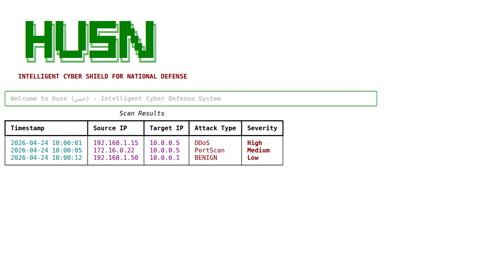
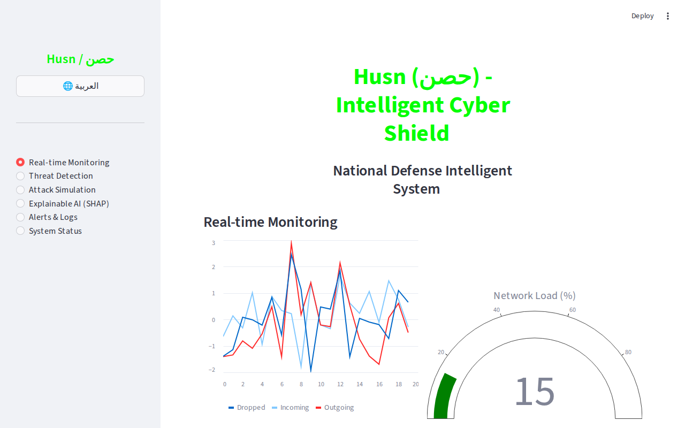
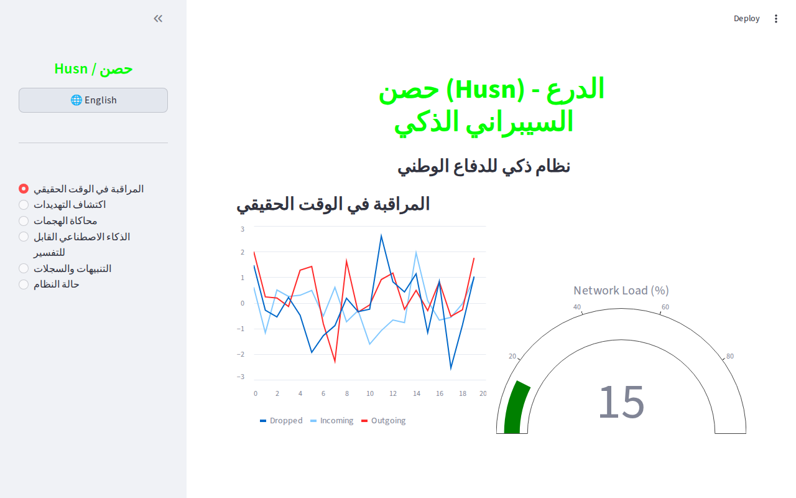

# Husn (حصن) - Intelligent Cyber Shield

<div align="center">
  
  <h3>Intelligent Cyber Defense System for National Security</h3>
</div>

Husn (حصن) is an AI-powered cybersecurity system designed for the DefensThon 2026 competition. It provides real-time network monitoring, threat detection, and attack simulation with explainable AI.

---

## 📸 Screenshots

### 🛠️ Professional CLI (Metasploit Style)


### 📊 Bilingual Web Dashboard



---

## 📁 Project Structure
```
husn/
├── data/               # Datasets
├── models/             # Trained AI models
├── src/
│   ├── ai/             # AI Model and SHAP logic
│   ├── core/           # Attack Simulation (Scapy)
│   ├── cli.py          # Interactive CLI
│   └── dashboard.py    # Streamlit Dashboard
└── tests/              # Unit tests
run.py                  # Entry point
```

## ✨ Features
- **Professional CLI**: Metasploit-style interactive shell with rich visualizations.
- **Web Dashboard**: Bilingual (English/Arabic) Streamlit dashboard with real-time monitoring and SHAP explanations.
- **AI-Powered Detection**: Hybrid model using XGBoost and IsolationForest for anomaly detection and multi-class attack classification.
- **Attack Simulation**: Realistic attack simulation using Scapy.

## 🚀 Installation
1. Clone the repository
2. Install dependencies:
   ```bash
   pip install -r requirements.txt
   ```

## 🛠️ Usage
Launch Husn using the `run.py` script:

- **Interactive CLI**:
  ```bash
  python run.py cli
  ```
- **Web Dashboard**:
  ```bash
  python run.py dashboard
  ```

---

# حصن (Husn) - الدرع السيبراني الذكي

حصن هو نظام للأمن السيبراني مدعوم بالذكاء الاصطناعي تم تطويره لمسابقة DefensThon 2026. يوفر النظام مراقبة الشبكة في الوقت الفعلي، واكتشاف التهديدات، ومحاكاة الهجمات مع شرح الذكاء الاصطناعي.

## المميزات
- **واجهة سطر الأوامر (CLI)**: واجهة احترافية بأسلوب Metasploit مع تصورات غنية.
- **لوحة معلومات الويب**: لوحة Streamlit ثنائية اللغة (العربية/الإنجليزية) مع مراقبة حقيقية وشرح SHAP.
- **الكشف المدعوم بالذكاء الاصطناعي**: نموذج هجين يستخدم XGBoost و IsolationForest لاكتشاف الشذوذ وتصنيف الهجمات.
- **محاكاة الهجمات**: محاكاة واقعية للهجمات باستخدام Scapy.

## التثبيت
1. استنساخ المستودع
2. تثبيت المتطلبات:
   ```bash
   pip install -r requirements.txt
   ```

## الاستخدام
- **واجهة سطر الأوامر**: `python run.py cli`
- **لوحة التحكم**: `python run.py dashboard`
